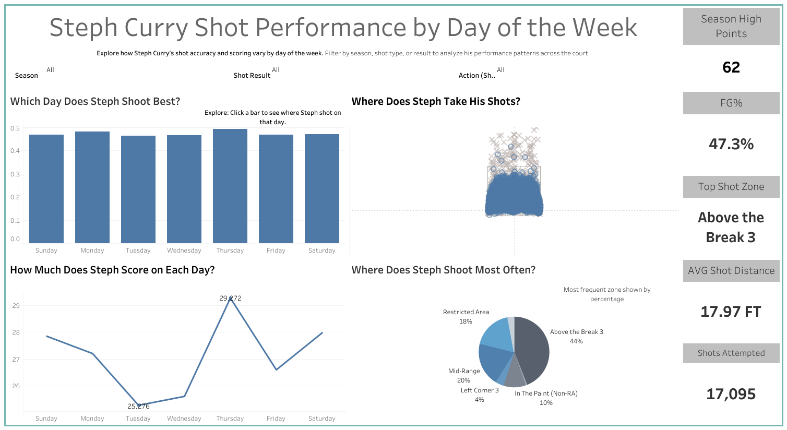

# Steph Curry Shot Performance Dashboard

🏀 This Tableau dashboard explores **Stephen Curry's shooting performance by day of the week** throughout his NBA career.

## 🔍 What You Can Explore
- Field Goal % by day of the week
- Average points scored per game by day
- Interactive shot chart (made vs missed)
- Shot zone distribution (pie chart)
- Stat cards for FG%, top zone, shot distance, and more

## 🛠️ Tools Used
- **Python** (`nba_api`) to collect full-career data
- **Pandas** for merging game logs and shot data
- **Tableau** for interactive visual design

## 📊 Dashboard
🔗 [View it on Tableau Public]([your_tableau_public_link_here](https://public.tableau.com/views/StephDashboard_17497642828390/Dashboard3?:language=en-US&:sid=&:redirect=auth&:display_count=n&:origin=viz_share_link))

## 📷 Preview

